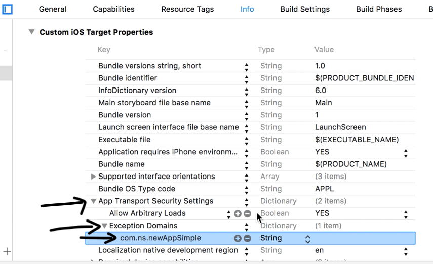

# Date Smarter 
project-g2 created by GitHub Classroom

System Requirements: 

  XCode

  - Google Services use CocoaPods to install and manage dependencies. Open a terminal window and navigate to the location of the Xcode project for the app. 
  - Create a profile if you do not have one:

    $ pod init 

  - Open your profile and add:

    pod 'Firebase/Analytics'

  - Save the file and run: 

    $ pod install 
    
    Running the API:
      Below are the settings needed for the API call to work. This is because the API we're using is HTTP, not HTTPS so the App Transport Security blocks       the unsecure connection, but making these changes below will allow the call to go through.
      
      Under "Custom iOS Target Properties," add a new item to the list called "App Transport Security Settings," making sure to have a type and value same as the screenshot. 
      Then add "Allow Arbitrary Loads." 
      Then under that, add "Exception Domains," and below that add "com.ip-api"
      Make sure the heirarchy of the settings match--i.e. "com.ip-api" goes under the "Exception Domains," which go under "App Transport Security Settings."
      
      
    
   
    

